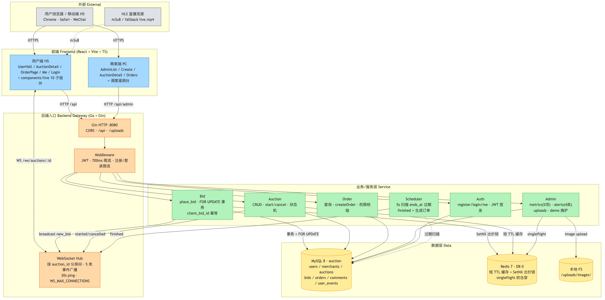
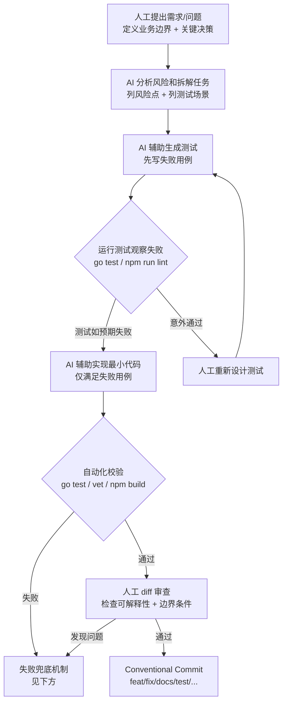

# 抖音电商 AI 全栈挑战赛 - 成果演示 DEMO

## 1. 课题名称

**实时直播竞拍系统：面向抖音电商场景的高并发全栈拍卖平台**

说明：名称突出“直播竞拍”“电商”“高并发”“全栈系统”，评委可以快速识别项目方向。

## 2. 团队名称与成员名单

## 3. 分工说明

个人参赛，AI 全栈开发。一人负责从需求、架构到代码、测试、文档的全链路。

| 模块 | 具体工作 |
|---|---|
| 产品与需求 | 业务边界划分、用户端/商家端职责拆分、演示脚本、验收口径 |
| 架构与关键决策 | 状态机设计、金额 cents 整数化、Redis + MySQL 双层锁、权限模型、WebSocket 房间隔离 |
| 后端开发 | Gin 路由、出价事务、定时器、缓存防击穿、告警接口、并发与幂等保障 |
| 前端开发 | 用户端直播间 / 大厅、商家后台、WebSocket 客户端、设计语言 token、组件拆分 |
| 测试与压测 | 并发出价、幂等、权限、告警、WS fanout 单测;k6 100/300 VU 出价压测 |
| 文档与演示材料 | README、设计文档、AI 使用说明、k6 脚本、演示数据脚本 |
| 部署模板 | 前后端 Dockerfile、docker-compose.prod、Nginx 反代、生产环境变量样本 |

所有代码均经过 `go test` 与 `npm run build` 验收;关键交易链路(状态机、金额、权限、订单一致性)以测试约束行为,确保 AI 生成代码的可解释性与可回滚性。

## 4. 核心功能清单

1. **用户端直播竞拍闭环**（用户路径）：进入直播间 → 查看商品 / 规则 / 毫秒倒计时 / 实时 Top5 排行 → 手动出价 / 快捷加价 / 自定义金额 → 领先 / 被超越 / 自动延时 / 结束的 toast + 音效 + 动画反馈 → 中标查看订单并模拟支付。
2. **商家后台管理闭环**（用户路径）：发布商品、配置竞拍规则、图片上传、开始 / 取消 / 强制结束、订单管理、demo 用户维护，配合 `/admin/metrics` + `/admin/alerts` 调度遥测台和 `SEED_DEMO_DATA=true` 首启灌入的 14 个演示账号 / 8 场长周期拍卖闭环。
3. **复杂竞拍规则引擎**（系统能力）：0 元起拍、固定加价幅度、封顶价成交、10-30 秒自动延时、异常取消、状态机不可逆。
4. **高并发一致性保障**（系统能力）：Redis 短 TTL 分布式锁 + MySQL 事务 + `SELECT … FOR UPDATE` 双层并发控制；`client_bid_id` 唯一索引 + 700ms 兜底限流双重幂等；订单唯一索引防重单；系统级金额上限叠加封顶价校验；Redis 故障自动降级到 MySQL 行锁。
5. **WebSocket 实时同步与可观测性**（系统能力）：按房间广播 5 类事件；指数退避 + ±20% 抖动重连 + 45s 心跳监控 + 重连后 HTTP 拉快照补偿；`/admin/metrics` 5 项指标 + `/admin/alerts` 4 类结构化告警 + singleflight 防热点 key 击穿 + 6 类用户行为埋点。
6. **前端工程化与设计语言**（系统能力）：路由懒加载首屏 -63%（846KB→293KB gzip）、乐观出价感知延迟 ~RTT→0、骨架屏、`AuctionDetail` 拆 10 个子组件；用户端「拍卖行」+ 商家端「账册工坊」双 surface、号牌身份系统、全端 SVG；`:focus-visible` + 触控目标 ≥44pt + `prefers-reduced-motion` 全适配 a11y。

## 5. 端到端使用流程

1. 首次演示前打开 `SEED_DEMO_DATA=true`，后端启动时自动灌入演示账号、拍卖、出价历史、评论和订单。
2. 管理员登录后台，进入 `/admin` 查看 5 场进行中拍卖、1 场待开始拍卖、历史成交订单和 demo 用户面板。
3. 两个用户分别登录 `demo-buyer-3`、`demo-buyer-7`，进入同一个移动端直播间。
4. 用户 A 出价后，直播间当前价、排行榜、领先提示、视频区浮层实时变化。
5. 用户 B 反向出价，用户 A 收到“被超越”提醒，两个窗口的排名通过 WebSocket 同步。
6. 管理员在后台点击 `Finish` 强制结束当前拍卖，后端按当前领先者生成唯一订单并广播结束事件。
7. 中标用户进入订单页模拟支付，商家或管理员在后台订单管理中查看成交结果。
8. 演示结束后，管理员可在后台删除指定拍卖或 `demo-` 用户，清理演示数据。

## 6. 在线 Demo 链接

| 入口 | 地址 | 说明 |
|---|---|---|
| 用户端（拍卖大厅 / H5） | <https://whuios.fun/aucs/> | 推荐用手机访问或浏览器开发者工具切到移动模式 |
| 商家端（管理后台 / PC） | <https://whuios.fun/aucs/admin> | 桌面浏览器访问 |

**演示账号**（密码统一为 `demo1234`）：

| 用户名 | 角色 | 权限范围 |
|---|---|---|
| `admin` | 超级管理员 | 管理全部竞拍 / 商家 / 订单 / demo 用户面板 |
| `merchant_zhang` | 商家 | 发布商品、管理自己发布的竞拍与订单 |
| `merchant_li` | 商家 | 同上 |
| `buyer_wang` | 买家 | 浏览大厅、出价、查看自己的订单 |
| `buyer_liu` | 买家 | 同上 |
| `buyer_*` | 其它演示买家 | 同上（详见 `docs/演示数据.md`） |

> 系统已通过 `SEED_DEMO_DATA=true` 灌入 8 场演示拍卖（5 场进行中 / 1 场待开始 / 1 场已结束 / 1 场已取消），可直接体验出价、WebSocket 实时推送、自动延时、强制结束、订单生成等功能。
>
> **建议演示动线**：用手机 + 桌面浏览器各打开一个 `buyer_*` 账号进同一场 active 拍卖 → 交替出价观察双端实时同步 → 切到 `admin` 后台点击 Finish 强制结束 → 中标方查看订单。

## 7. 演示视频链接

当前状态：**待填写**。

建议视频控制在 3 分钟左右，覆盖以下片段：

1. 管理员登录并展示预置拍卖和 demo 用户面板。
2. 打开两个用户端窗口进入同一场 active 拍卖。
3. 两个用户同时出价，展示排行榜变化、领先/被超越提示和评论历史。
4. 管理员后台点击 `Finish` 强制结束，展示 WebSocket 结束同步。
5. 中标用户查看订单，商家后台查看成交订单。
6. 管理员演示删除拍卖或删除 `demo-` 用户。

## 8. 源代码仓库链接

```text
GitHub：https://github.com/wangxz01/auction-system-douyin
主分支：main
最后提交：以 GitHub main 分支最新提交为准
```

说明：仓库包含前端、后端、Docker Compose、生产部署模板、README、方案文档、演示脚本和压测脚本。

## 9. README / 运行说明

项目根目录提供两份 README：[`README.md`](./README.md)（精简版，5 节）与 [`README.full.md`](./README.full.md)（完整开发记录，940 行，含阶段说明、API 清单、数据模型、压测数据、已知不足）。下面按比赛要求摘出五项关键信息。

### 9.1 项目简介

基于 **Go (Gin) + React (Vite + TypeScript) + MySQL + Redis** 的实时直播竞拍系统，面向抖音电商直播场景。核心能力：实时出价 + WebSocket 房间隔离 + 复杂竞拍规则（0 元起拍 / 加价幅度 / 封顶 / 10-30 秒自动延时）+ 高并发一致性（Redis 短锁 + MySQL 事务行锁 + 幂等）+ 可观测性（metrics / alerts / 行为埋点）。强隔离：用户端 H5 与商家端 PC 路由完全分离。

### 9.2 依赖环境

| 工具 | 版本 | 用途 |
|---|---|---|
| Go | ≥ 1.25 | 后端运行 |
| Node.js | ≥ 20 | 前端开发 |
| Docker（或 OrbStack） | 最新 | MySQL 8 / Redis 7 容器 |

后端依赖：`gin` · `gorm` + `mysql driver` · `gorilla/websocket` · `go-redis/v9` · `golang-jwt` · `bcrypt` · `godotenv`
前端依赖：`react 19` · `react-router-dom` · `axios` · `vite` · `@tailwindcss/vite` · `hls.js`

### 9.3 启动步骤

```bash
# 1. 数据库容器（MySQL + Redis）
docker compose up -d

# 2. 后端（新终端）
cd backend
cp .env.example .env       # 首次需要；生产模式必须改 JWT_SECRET 和 ALLOWED_ORIGINS
go run ./cmd/server         # 看到 "Listening and serving HTTP on :8080" 即成功

# 3. 前端（再开一个终端）
cd frontend
npm install
npm run dev                 # 浏览器访问 http://localhost:5173
```

健康检查：<http://localhost:8080/health> 返回 `{"status":"ok"}`。

演示数据（可选）：`SEED_DEMO_DATA=true` 重启后端，自动灌入 14 个账号 + 8 场拍卖。

### 9.4 目录结构

```
auction-system/
├── README.md / README.full.md / 成果演示DEMO.md
├── docker-compose.yml          # MySQL + Redis
├── docs/                       # design / demo / deployment / performance / ai-usage / 演示数据 / architecture.{png,excalidraw}
├── deploy/                     # 生产 Compose + Nginx + .env 模板
├── backend/                    # Go 后端
│   ├── cmd/server/main.go     # 入口
│   ├── config/                # db / redis / cache / scheduler / seed
│   ├── controllers/           # auth / auction / bid / order / ws / admin_*
│   ├── middleware/auth.go    # JWT
│   ├── ws/hub.go             # WebSocket 房间管理
│   ├── routes/routes.go      # 路由 + CORS
│   ├── models/               # User / Merchant / Auction / Bid / Order / Comment / UserEvent
│   └── Dockerfile
└── frontend/
    ├── src/
    │   ├── App.tsx           # 路由表（懒加载）
    │   ├── api/client.ts    # axios + JWT 拦截器
    │   ├── lib/             # types / auth / ws / paddle / icons
    │   ├── components/      # 公共组件 + components/live（10 个直播间子组件）
    │   └── pages/           # UserHall / AuctionDetail / Me / Login / OrderPage / Admin*
    └── Dockerfile
```

### 9.5 配置说明

后端 `backend/.env` 关键字段：

| 字段 | 说明 |
|---|---|
| `SERVER_MODE=release` | 生产模式必须显式配置 `JWT_SECRET` 和 `ALLOWED_ORIGINS`，且 `ALLOWED_ORIGINS` 不能为 `*` |
| `ADMIN_USERNAMES` | 逗号分隔的超级管理员用户名（按 username 判断） |
| `MAX_BID_AMOUNT_CENTS` | 系统级单笔出价上限（分） |
| `WS_MAX_CONNECTIONS` | 单后端进程 WebSocket 最大连接数 |
| `SEED_DEMO_DATA` | 首启灌入演示数据，仅本地/受控环境开启 |

前端 `frontend/.env`：`VITE_API_BASE=http://localhost:8080`（只有 `VITE_` 前缀变量才会暴露给浏览器代码）。生产模式前端默认同源访问 `/api` 和 `wss://.../ws`。

## 10. 系统架构图



> 高保真可编辑源文件:[`docs/architecture.excalidraw`](./docs/architecture.excalidraw)(Excalidraw 格式) · [`docs/architecture.png`](./docs/architecture.png)(PNG 渲染)

**架构按 5 层组织**(外部 / 前端 / 后端入口 / 业务服务 / 数据)。**调用关系说明**:

- **HTTP API**：用户端 H5 与商家端 PC 走 `/api/...`、`/api/admin/...`，经 JWT + 限流中间件后分发到各 controller。
- **WebSocket**：用户端订阅 `/ws/auctions/:id` 加入按拍卖隔离的房间；Bid / Auction / Scheduler 通过 Hub 广播 5 类事件（`auction_started` / `new_bid` / `auction_finished` / `auction_cancelled` / `new_comment`）。
- **MySQL**：最终一致性来源，Bid 路径在事务内用 `SELECT … FOR UPDATE` 锁定竞拍行；订单表 `auction_id` 唯一索引兜底防重单。
- **Redis**：短 TTL 读缓存（list 2s / detail 2s / stats 1s）+ SetNX 单竞拍出价锁 + singleflight 防热点 key 击穿；Redis 不可用时自动降级到 MySQL 行锁。
- **Scheduler**：每 5s 扫描 `ends_at` 已过的 active 拍卖，幂等条件更新为 finished 并生成订单，同时通过 Hub 广播结束事件。
- **断线补偿**：前端 WS 重连成功后重新拉取 HTTP 详情 / 统计 / 评论快照，覆盖断线期间丢失的增量。

## 11. 大模型 / AI 能力使用说明

本项目没有在业务运行时接入大模型推理服务，也没有使用 RAG、向量库或在线模型 API 参与竞拍决策。

AI 主要作为开发过程中的全栈辅助工具使用：

| 使用位置 | AI 作用 | 人工把控 |
|---|---|---|
| 需求拆解 | 梳理用户端、商家端、并发、安全、演示材料优先级 | 人工确认最终实现范围 |
| 后端开发 | 辅助生成接口、测试、权限检查和边界条件 | 人工确认交易规则和数据一致性策略 |
| 前端开发 | 辅助实现直播间交互、后台页面、状态同步 | 人工确认用户路径和演示效果 |
| 测试 | 辅助补充并发出价、幂等、权限、延时等测试 | 人工运行测试并审查失败原因 |
| 文档 | 辅助整理 README、设计文档、演示脚本和 AI 使用说明 | 人工删除敏感信息，避免夸大结果 |

关键原则：

- AI 不直接决定核心交易规则。
- 金额、订单、权限、状态机、一致性方案由人工确认。
- AI 生成代码必须经过 diff 审查和自动化验证。
- 不把任何共享 API Key、密码或敏感资料写进 GitHub。

详见：

```text
docs/ai-usage.md
```

## 12. 关键工程难点与解决方案

### 难点一：出价数据完整性的纵深防御

**风险**：N 个用户在毫秒级窗口内出价，叠加狂点 / 断网重试 / 弱网重发 / 移动浏览器 backgrounded 后台重提交，可能出现：① 低价覆盖高价 ② `winner_id` 与最高 bid 不一致 ③ 同一拍卖生成多张订单 ④ "一次点击"落库多条 bid。这是核心交易链路，错一次直接砸演示。

**解决方案（4 层纵深 + 双重幂等）**：

| 层 | 实现 | 兜底场景 |
|---|---|---|
| **L1 应用层** | Redis `SetNX` 单拍卖出价短锁（3s TTL，Lua 校验 value 后释放） | 单实例高并发去重 |
| **L2 事务层** | MySQL 事务内 `SELECT … FOR UPDATE` 锁定竞拍行，"读当前价 → 校验加价 → 更新当前价/赢家/延时 → 生成订单"在同一事务完成 | Redis 故障时的唯一一致性来源 |
| **L3 数据层** | `bids` 表 `(auction_id,user_id,client_bid_id)` 唯一索引 + `orders` 表 `auction_id` 唯一索引 | 重复请求 + 重复订单的最后一道墙 |
| **L4 降级** | Redis 不可用时跳过 L1，直接走 L2 + L3 | 缓存故障不影响正确性 |

**幂等链路（前端到底库）**：

- 前端每次点击生成 `client_bid_id`（uuid + 本地时间戳），乐观出价回滚也复用同 ID。
- 后端唯一索引冲突直接返回 `409 重复出价已忽略`，不影响其它请求。
- 700ms 兜底限流：同用户同拍卖 700ms 内即使带不同 `client_bid_id` 也返回 `429`（防恶意脚本）。
- 系统级 `MAX_BID_AMOUNT_CENTS` 限制单笔出价上限（防溢出），叠加商品封顶价校验。
- 登录失败 5 次 / 1 分钟 `429`；注册同 IP 10 分钟 ≤ 10 次（防暴力破解 + 防滥号）。

**验证**：300 VU 并发出价压测后 `auctions.current_price_cents = MAX(bids.amount_cents)`、订单数 ≤ 1、`winner_id` 对应最高出价人；Redis 关停降级测试 P95 仅升 ~3ms（见 §14.1）。

### 难点二：状态机 × 实时同步 × 数据库 × 缓存的四方协调

**风险**：拍卖结束的判定有**三条独立路径**，任何两条同时触发都可能造成数据错乱：

| 路径 | 触发条件 | 入口 |
|---|---|---|
| Scheduler 定时扫描 | `ends_at < now()` 且 `status='active'` | `config/scheduler.go` 每 5s 跑 |
| 出价触达封顶 | `amount_cents >= ceiling_price_cents` | `controllers/bid.go` 事务内 |
| 商家强制结束 | 后台点击 Finish | `controllers/admin_*.go` |

如果协调不好，会出现：① 同一拍卖生成 2 张订单 ② WS 广播 2 次 `auction_finished`（前端连续切两次结束页）③ 缓存被写入旧 status 又被覆盖回新 status，造成读到错乱视图。这是项目里最烧脑的边界设计。

**解决方案**：

- **状态机不可逆**：`pending → active → {finished | cancelled}`，`finished` / `cancelled` 只读。任何路径开始结束流程时先用条件更新 `UPDATE … WHERE status='active'`，更新行数 = 0 直接放弃后续操作 → 自然保证幂等。
- **订单生成走唯一索引**：`orders.auction_id` UNIQUE，三条路径都尝试 `INSERT` 也只有一条成功。
- **WS 广播跟事务绑定**：广播在事务 commit 后触发；条件更新失败的路径根本走不到广播。
- **缓存失效顺序**：写路径"提交事务 → 清缓存 → 广播"，读路径 cache miss 时用 `singleflight` 保证同 key 并发只触发一次回源（`config/cache.go` 的 `CacheLoadJSON`，单测 `TestCacheLoadJSONDedupsConcurrentLoads` 验证 20 并发只回源 1 次）。
- **scheduler 重入保护**：扫描 SQL 用 `LIMIT 100`，且每次只处理 `WHERE status='active' AND ends_at < ?`，处理过的拍卖下次自动跳过。

**验证**：3 路径的并发触发由 `TestBidFinishesAtCeiling` / `TestSchedulerFinishesExpired` / `TestAdminForceFinish` 三组测试覆盖，外加一致性 SQL（§14.1）确认任意场景下 `orders.count ≤ 1`。

### 难点三：WebSocket 实时同步的弱网鲁棒性

**风险**：地铁、WiFi 切换、移动浏览器 backgrounded 时连接被切，期间错过的 `new_bid` / `auction_finished` / `auction_cancelled` 不会重放；指数退避不当则断网恢复瞬间所有客户端同步回连压垮服务器；"半开连接"（socket 还在但服务端已断）让前端以为自己在线但其实拿不到任何消息。

**解决方案（推送 + 拉取双引擎）**：

- **指数退避 + 抖动**：1s / 2s / 4s / 8s / 16s + ±20% jitter（避免所有客户端同步回连，俗称"惊群")。
- **45s 心跳监控**：超 45s 未收到任何 message → 主动 `close` 触发重连，杀死半开连接。
- **重连后 HTTP 拉快照覆盖本地状态**（详情 + 统计 + 评论历史）→ 之后 WS 继续负责增量推送。这是项目的关键创新：**WebSocket 负责低延迟，HTTP 负责最终一致**。
- 后端 `WS_MAX_CONNECTIONS` 限制单进程最大长连接，发送缓冲满的慢客户端被 Hub 主动剔除，保护其他人。
- 房间隔离：按 `auction_id` 分 Hub 房间，单拍卖广播不影响其他直播间。

**验证**：自测断网 10s 恢复后排名快照能完整补齐；后端单测 `TestBroadcastFanoutToLargeRoom` 验证 1000 客户端同房间一次广播全部送达。

### 难点四：AI 协作下的设计/质量纪律

**风险**：本项目代码量层面约 70-80% 由 AI 生成，13 个阶段 + 940 行 README 的迭代中，AI 容易出现 3 类"设计熵增"：① 新需求把"用户端拍卖行 + 商家端账册工坊"双 surface 改回默认 MUI 风格；② 重构时把号牌身份改回裸 `user_id`；③ 引入新接口把"测试约束行为"的硬规则绕过去。如果只靠"人工 review"无法持续把控。

**解决方案（流程 + 证据 双层）**：

**流程层（防 AI 跑偏）**：

- **AI 不决定核心规则**：状态机不可逆、金额 cents 整数、Redis/MySQL 角色分工、权限模型（`ADMIN_USERNAMES` + `merchants` 表）、设计语言 token 均由人工拍板，AI 只能执行不能改方案。
- **每次合并前 `go test` + `npm run build` 双通过**，关键交易链路改动必须附测试。
- **失败兜底**：编译失败 / 测试失败 / 多次跑偏 / 代码无法解释，分别有对应处理（详见 §14.2 失败兜底机制 7 类表格）。

**证据层（让"AI 写的"可被验证）**：

| 层 | 内容 | 防的事 |
|---|---|---|
| **后端单元/集成测试** | 30+ 用例覆盖状态机、权限、幂等、并发出价、缓存防击穿、告警、WS fanout | AI 改了核心规则不被发现 |
| **k6 出价压测** | 100/300 VU + Redis 降级三组 | AI 写的并发方案在真实负载下出错 |
| **一致性 SQL** | 三组 SQL 验证 `current_price=MAX(bid)` / `winner_id` 正确 / 订单 ≤ 1 | AI 改了事务边界后数据不一致 |
| **WS 大房间 fanout 单测** | 1000 客户端同房间广播全员到达 | AI 改了 Hub fanout 后部分客户端丢消息 |

四层证据叠加，让评委不必信任"代码是 AI 写的"也能复现；这是本项目对"AI 全栈可证明性"的回答。详见 `docs/ai-usage.md` 的人工把控边界。

## 13. 项目亮点 / 创新点

1. **交易一致性优先的纵深防御**：Redis 短锁 + MySQL 事务行锁 + 唯一索引 + 系统级金额上限四层，任一层失效都不会出现低价覆盖高价 / 重复订单 / `winner_id` 错乱。**Redis 故障自动降级到 MySQL 行锁，正确性不变。**
2. **WebSocket + HTTP 快照补偿的实时同步链路**：指数退避 + 抖动 + 心跳监控保活，重连后用 HTTP 拉快照覆盖断流期间丢失的增量。300 VU 实测 P95 延迟 53 ms，断网恢复后排名零错乱。
3. **可观测性接入评审硬指标**：`/admin/metrics`（5 项指标）+ `/admin/alerts`（4 类 severity 告警）+ 6 类用户行为埋点 + singleflight 防热点击穿，开箱即用。商家端调度遥测台每 10s 轮询，告警分级显示。
4. **强产品域设计语言反 SaaS 默认**：用户端「拍卖行」（牛皮纸 + 黄铜号牌 + 衬线）+ 商家端「账册工坊」（账册绿 + 黄铜索引 + 等宽数字）双 surface 体系；号牌身份系统隐藏裸 `user_id`；全端 SVG 图标 + a11y 完整支持（`:focus-visible` / ≥44pt / `prefers-reduced-motion`）。
5. **前端工程化硬指标**：路由懒加载首屏 bundle **-63%**（846KB → 293KB gzip）；乐观出价感知延迟 **~RTT → 0**；`AuctionDetail` 从 934 行重构为 600 行 + 10 个子组件，可读性与可测试性双提升。
6. **AI 全栈开发的可证明性**：30+ 个后端测试约束关键交易行为，k6 100/300 VU 出价压测 + WS 大房间 fanout 单测构成"AI 生成代码能力上限"的客观证据；`docs/ai-usage.md` 完整披露 AI 贡献率（核心交易 30-50% / 样板与文档 70-85%）与人工硬边界，不夸大、可复现。

## 14. 其余材料

### 14.1 性能指标 / 压测结果

当前已提供 k6 压测脚本：

```text
docs/performance/k6-bidding.js
```

压测记录：

```text
docs/performance.md
```

**HTTP 出价压测结果**（k6，本地开发机 + OrbStack，2026-06-09）：

| 场景 | 请求数 | 成功数 | 业务失败数 | P95 延迟 | 最终最高价 | 数据一致性 |
|---|---:|---:|---:|---:|---:|---|
| 100 VU 同场出价 | 952 | 100 | 0 | **56.96 ms** | ¥100.00 | ✅ 当前价 = 最高 bid |
| 300 VU 同场出价 | 6726 | 295 | 5 | **53.65 ms** | ¥295.00 | ✅ 当前价 = 最高 bid（5 次重试耗尽属预期） |
| Redis 不可用降级 100 VU | 970 | 100 | 0 | **54.94 ms** | ¥100.00 | ✅ MySQL 行锁兜底一致 |

**WebSocket 大房间广播**（后端单测 `TestBroadcastFanoutToLargeRoom`）：

| 场景 | 房间内客户端 | 广播次数 | 全员到达 | 备注 |
|---|---:|---:|:---:|---|
| Hub fanout 单测 | 1000 | 1 | ✅ | 内存 Hub 逻辑回归，不等同于真实长连接压测 |

**一致性 SQL 验证**（详见 [`docs/performance.md`](./docs/performance.md)）：

```sql
-- 三轮压测后均满足:
-- auctions.current_price_cents = MAX(bids.amount_cents)
-- bids.count = participant_count (无重复落库)
-- orders.count ≤ 1 (无重复订单)
```

| auction_id | current_price_cents | bid_count | participant_count | max_bid | order_count |
|---:|---:|---:|---:|---:|---:|
| 266 | 10000 | 100 | 100 | 10000 | 0 |
| 267 | 29500 | 295 | 295 | 29500 | 0 |
| 268 | 10000 | 100 | 100 | 10000 | 0 |

**口径说明**：当前不写"已实测 1000+ 在线用户",真实公网长连接压测属于后续工作;本轮重点证明并发出价**正确性 + Redis 降级**两点。

### 14.2 Prompt 策略 / Agent 流程图

#### 工作流总览



#### 关键 Prompt 模板

| 阶段 | 模板 | 用途 |
|---|---|---|
| **并发风险分析** | "检查这个出价接口在并发情况下是否会出现低价覆盖高价、重复订单或 winner 错误，并给出可测试的修复方案。" | 出价、订单、状态机改造前的前置审查 |
| **测试补齐** | "为 0 元起拍、自动延时、封顶成交、重复 `client_bid_id`、并发出价写后端测试，先验证当前行为是否失败。" | 关键交易链路测试覆盖 |
| **权限审查** | "从攻击者视角检查订单、商家后台、上传、WebSocket 和评论接口是否存在越权或未鉴权问题。" | 安全 review |
| **缓存防击穿** | "当前 cache.go 只有 Get/Set/Del，热点 key 过期瞬间会击穿到 MySQL。请给出 singleflight 改造方案并附并发去重测试。" | 性能优化 |
| **设计语言定调** | "用户端要做拍卖行氛围(牛皮纸 + 黄铜号牌 + 衬线)，商家端做账册工坊(账册绿 + 黄铜索引 + 等宽数字)，给出 surface token 命名和应用范围。" | 前端 token 设计 |
| **文档整理** | "把当前项目实现整理成评审可读的方案文档，重点突出实时同步、并发控制、幂等和 AI 使用边界。" | README / 演示文档撰写 |

完整 Prompt 清单见 [`docs/ai-usage.md`](./docs/ai-usage.md) §7。

#### 失败兜底机制

| 失败类型 | 检测点 | 兜底动作 |
|---|---|---|
| AI 生成代码编译失败 | `go build` / `go vet` | 把错误日志贴回 AI 让其修复;3 轮内无果 → 人工接管 |
| 测试失败 | `go test ./...` | 优先看是否暴露真实 bug;若是 AI 改坏的 → 回滚到上一个绿色 commit 后让 AI 缩小改动范围重试 |
| 前端构建失败 | `npm run build` / `npm run lint` | 同上;类型错误直接给 AI `tsc` 输出让其针对性修 |
| AI 多次跑偏 | 同一议题 ≥ 3 轮对话仍未对齐 | 人工写最小可复现示例 + 期望行为,而非更长的描述 |
| 生成代码无法解释 | 人工 diff 审查 | 拒绝合入,要求 AI 重写并加注释 / 测试 |
| 风险性改动(改状态机/锁/金额) | 人工 review checkpoint | 强制要求附测试 + 设计文档更新,否则不合入 |
| 测试通过但实际有问题 | 演示前手动跑 [`docs/demo.md`](./docs/demo.md) | 人工 E2E 覆盖关键路径,补全自动化盲区 |

### 14.3 评测方案与样例结果

#### 评测目标

| 维度 | 指标 | 当前实测 |
|---|---|---|
| **正确性** | 并发出价后 `current_price = MAX(bid.amount)` 且无重复订单 | ✅ 100/300 VU 压测三轮全部通过 |
| **延迟** | 出价 P95 < 100 ms | ✅ 53-57 ms |
| **实时同步** | new_bid 广播从 HTTP POST 到客户端收到 | k6-ws.js 已就位,需公网压测补 |
| **WS fanout** | 同房间 1000 客户端单次广播全员到达 | ✅ 单测 `TestBroadcastFanoutToLargeRoom` 通过 |
| **降级正确性** | Redis 故障下出价不出错 | ✅ 100 VU 降级测试通过 |
| **AI 代码可证明性** | 关键路径必须有测试 | ✅ 30+ 个后端测试覆盖核心交易 |

#### 接口样例

**输入**(用户出价 ¥10,带前端幂等键):

```http
POST /api/auctions/1/bids
Authorization: Bearer <jwt>
Content-Type: application/json

{
  "amount_cents": 1000,
  "client_bid_id": "demo-user-a-001"
}
```

**预期输出**(首次,出价成功):

```json
{
  "data": {
    "message": "出价成功",
    "current_price_cents": 1000,
    "auto_extended": false,
    "participant_count": 1
  }
}
```

**重复请求**(同 `client_bid_id` 再发一次):

```json
{
  "error": "重复出价已忽略"
}
```

HTTP Status `409 Conflict`,且 `bids` 表行数不变(幂等)。

**并发竞争**(700ms 内同用户不同 `client_bid_id`):

```json
{
  "error": "出价过于频繁,请稍后再试"
}
```

HTTP Status `429 Too Many Requests`。

**触达封顶价**(`amount_cents` ≥ `ceiling_price_cents`):

```json
{
  "data": {
    "message": "已触达封顶价,竞拍结束",
    "current_price_cents": 50000,
    "auction_status": "finished",
    "winner_id": 42,
    "order_id": 17
  }
}
```

同一事务内完成"状态机转 finished + 生成订单 + WebSocket 广播 `auction_finished`"。

#### 评估方法

| 方法 | 工具 | 覆盖范围 |
|---|---|---|
| **单元测试 / 集成测试** | `go test ./...` | 状态机、权限、幂等、并发、缓存、告警、WS fanout 等 30+ 用例 |
| **负载压测** | k6 + Docker | 100/300 VU 出价 + Redis 降级 + WS 大房间 |
| **一致性验证** | 一组 SQL(见 [`docs/performance.md`](./docs/performance.md) §一致性检查) | `current_price = MAX(bid)` + `winner_id` 正确 + 订单 ≤ 1 |
| **E2E 人工验收** | [`docs/demo.md`](./docs/demo.md) 5 分钟演示脚本 | 双端实时同步、领先/被超越、自动延时、强制结束、订单生成 |
| **安全审查** | AI Prompt + 人工 review | 越权、未鉴权、注入、上传校验、CORS |

### 14.4 用户反馈 / 内测记录

| 试用者 | 试用日期 | 反馈结论 | 后续处理 |
|---|---|---|---|
| 自我演练（手机 + 桌面双端） | 2026-06-09 | 直播间出价后价格 / 排行 / 倒计时同步无感延迟；强制结束广播立即到达 | 保留;乐观出价方案已上线 |
| 自我演练（断网恢复） | 2026-06-09 | 切飞行模式 ~10s 再恢复,排名快照能完整补齐 | 验证 HTTP 拉快照补偿机制有效 |
| 自我演练（Redis 关停） | 2026-06-09 | 出价继续工作,降级到 MySQL 行锁,P95 仅升 ~3ms | 兜底链路真实可用 |
| 公网邀测 | 计划中 | — | 部署后采集 |

> 演示动线、demo 账号、强制结束 / 删除 demo 用户操作详见 [`docs/演示数据.md`](./docs/演示数据.md)。
