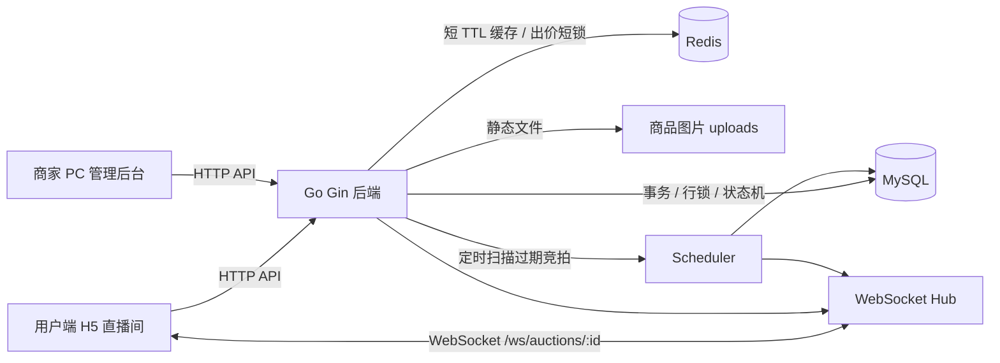
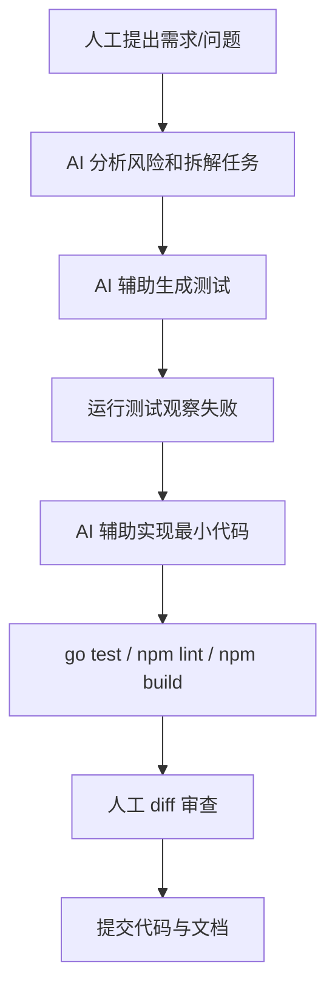

# 抖音电商 AI 全栈挑战赛 - 成果演示 DEMO

## 1. 课题名称

**实时直播竞拍系统：面向抖音电商场景的高并发全栈拍卖平台**

说明：名称突出“直播竞拍”“电商”“高并发”“全栈系统”，评委可以快速识别项目方向。

## 2. 团队名称与成员名单

| 姓名 | 学校 | 专业 | 角色 |
|---|---|---|---|
| 待填写 | 待填写 | 待填写 | 项目负责人 / 全栈开发 |
| 待填写 | 待填写 | 待填写 | 前端 / 交互设计 |
| 待填写 | 待填写 | 待填写 | 后端 / 架构设计 |

如果是个人参赛，可保留一行，并将角色写为“全栈开发、产品设计、测试与文档”。

## 3. 分工说明

个人参赛，AI 全栈开发。一人负责从需求、架构到代码、测试、文档的全链路。

| 模块 | 具体工作 |
|---|---|
| 产品与需求 | 业务边界划分、用户端/商家端职责拆分、演示脚本、验收口径 |
| 架构与关键决策 | 状态机设计、金额 cents 整数化、Redis + MySQL 双层锁、权限模型、WebSocket 房间隔离 |
| 后端开发 | Gin 路由、出价事务、定时器、缓存防击穿、告警接口、并发与幂等保障 |
| 前端开发 | 用户端直播间 / 大厅、商家后台、WebSocket 客户端、设计语言 token、组件拆分 |
| 测试与压测 | 并发出价、幂等、权限、告警、WS fanout 单测;k6 100/300 VU 出价压测 |
| 文档与演示材料 | README、设计文档、AI 使用说明、k6 脚本、演示数据脚本 |
| 部署模板 | 前后端 Dockerfile、docker-compose.prod、Nginx 反代、生产环境变量样本 |

所有代码均经过 `go test` 与 `npm run build` 验收;关键交易链路(状态机、金额、权限、订单一致性)以测试约束行为,确保 AI 生成代码的可解释性与可回滚性。

## 4. 核心功能清单

1. **用户端直播竞拍闭环**（用户路径）：进入直播间 → 查看商品 / 规则 / 毫秒倒计时 / 实时 Top5 排行 → 手动出价 / 快捷加价 / 自定义金额 → 领先 / 被超越 / 自动延时 / 结束的 toast + 音效 + 动画反馈 → 中标查看订单并模拟支付。
2. **商家后台管理闭环**（用户路径）：发布商品、配置竞拍规则、图片上传、开始 / 取消 / 强制结束、订单管理、demo 用户维护，配合 `/admin/metrics` + `/admin/alerts` 调度遥测台和 `SEED_DEMO_DATA=true` 首启灌入的 14 个演示账号 / 8 场长周期拍卖闭环。
3. **复杂竞拍规则引擎**（系统能力）：0 元起拍、固定加价幅度、封顶价成交、10-30 秒自动延时、异常取消、状态机不可逆。
4. **高并发一致性保障**（系统能力）：Redis 短 TTL 分布式锁 + MySQL 事务 + `SELECT … FOR UPDATE` 双层并发控制；`client_bid_id` 唯一索引 + 700ms 兜底限流双重幂等；订单唯一索引防重单；系统级金额上限叠加封顶价校验；Redis 故障自动降级到 MySQL 行锁。
5. **WebSocket 实时同步与可观测性**（系统能力）：按房间广播 5 类事件；指数退避 + ±20% 抖动重连 + 45s 心跳监控 + 重连后 HTTP 拉快照补偿；`/admin/metrics` 5 项指标 + `/admin/alerts` 4 类结构化告警 + singleflight 防热点 key 击穿 + 6 类用户行为埋点。
6. **前端工程化与设计语言**（系统能力）：路由懒加载首屏 -63%（846KB→293KB gzip）、乐观出价感知延迟 ~RTT→0、骨架屏、`AuctionDetail` 拆 10 个子组件；用户端「拍卖行」+ 商家端「账册工坊」双 surface、号牌身份系统、全端 SVG；`:focus-visible` + 触控目标 ≥44pt + `prefers-reduced-motion` 全适配 a11y。

## 5. 端到端使用流程

1. 首次演示前打开 `SEED_DEMO_DATA=true`，后端启动时自动灌入演示账号、拍卖、出价历史、评论和订单。
2. 管理员登录后台，进入 `/admin` 查看 5 场进行中拍卖、1 场待开始拍卖、历史成交订单和 demo 用户面板。
3. 两个用户分别登录 `demo-buyer-3`、`demo-buyer-7`，进入同一个移动端直播间。
4. 用户 A 出价后，直播间当前价、排行榜、领先提示、视频区浮层实时变化。
5. 用户 B 反向出价，用户 A 收到“被超越”提醒，两个窗口的排名通过 WebSocket 同步。
6. 管理员在后台点击 `Finish` 强制结束当前拍卖，后端按当前领先者生成唯一订单并广播结束事件。
7. 中标用户进入订单页模拟支付，商家或管理员在后台订单管理中查看成交结果。
8. 演示结束后，管理员可在后台删除指定拍卖或 `demo-` 用户，清理演示数据。

## 6. 在线 Demo 链接

当前状态：**待填写**。

建议填写形式：

```text
在线 Demo：https://your-demo-domain.example.com
管理员账号：admin
管理员密码：演示时口头提供 / 私下提供
用户账号：可现场注册，或提供 user_a / user_b
演示用户：demo-buyer-3 / demo1234，demo-buyer-7 / demo1234
演示商家：demo-merchant-1 / demo1234，demo-merchant-2 / demo1234
```

如果暂时没有公网部署，可使用录屏替代，并在说明中写：

```text
本项目当前提供本地运行演示，在线 Demo 以演示视频为准。
```

## 7. 演示视频链接

当前状态：**待填写**。

建议视频控制在 3 分钟左右，覆盖以下片段：

1. 管理员登录并展示预置拍卖和 demo 用户面板。
2. 打开两个用户端窗口进入同一场 active 拍卖。
3. 两个用户同时出价，展示排行榜变化、领先/被超越提示和评论历史。
4. 管理员后台点击 `Finish` 强制结束，展示 WebSocket 结束同步。
5. 中标用户查看订单，商家后台查看成交订单。
6. 管理员演示删除拍卖或删除 `demo-` 用户。

## 8. 源代码仓库链接

```text
GitHub：https://github.com/wangxz01/auction-system-douyin
主分支：main
最后提交：以 GitHub main 分支最新提交为准
```

说明：仓库包含前端、后端、Docker Compose、生产部署模板、README、方案文档、演示脚本和压测脚本。

## 9. README / 运行说明

项目根目录已提供 `README.md`，包含：

- 项目简介
- 用户端和商家端入口
- 当前开发进度
- API 路由清单
- 数据模型说明
- 环境变量配置
- MySQL / Redis 启动方式
- 前后端启动步骤
- 生产部署准备
- 超级管理员账号说明
- 高并发与实时同步方案
- AI 工具使用沉淀

本地启动摘要：

```bash
docker compose up -d

cd backend
go run ./cmd/server

cd frontend
npm install
npm run dev
```

前端默认地址：

```text
http://localhost:5173
```

后端健康检查：

```text
http://localhost:8080/health
```

## 10. 系统架构图



调用关系说明：

- HTTP API 负责可靠读写、鉴权、出价、订单和后台管理。
- WebSocket 负责实时广播出价、倒计时、结束、取消和评论。
- MySQL 是最终一致性来源，存储竞拍、出价、订单、评论、用户和商家。
- Redis 用于短 TTL 读缓存和单竞拍出价短锁。
- 前端重连后会重新拉取 HTTP 快照，补偿 WebSocket 断线期间丢失的消息。

## 11. 大模型 / AI 能力使用说明

本项目没有在业务运行时接入大模型推理服务，也没有使用 RAG、向量库或在线模型 API 参与竞拍决策。

AI 主要作为开发过程中的全栈辅助工具使用：

| 使用位置 | AI 作用 | 人工把控 |
|---|---|---|
| 需求拆解 | 梳理用户端、商家端、并发、安全、演示材料优先级 | 人工确认最终实现范围 |
| 后端开发 | 辅助生成接口、测试、权限检查和边界条件 | 人工确认交易规则和数据一致性策略 |
| 前端开发 | 辅助实现直播间交互、后台页面、状态同步 | 人工确认用户路径和演示效果 |
| 测试 | 辅助补充并发出价、幂等、权限、延时等测试 | 人工运行测试并审查失败原因 |
| 文档 | 辅助整理 README、设计文档、演示脚本和 AI 使用说明 | 人工删除敏感信息，避免夸大结果 |

关键原则：

- AI 不直接决定核心交易规则。
- 金额、订单、权限、状态机、一致性方案由人工确认。
- AI 生成代码必须经过 diff 审查和自动化验证。
- 不把任何共享 API Key、密码或敏感资料写进 GitHub。

详见：

```text
docs/ai-usage.md
```

## 12. 关键工程难点与解决方案

### 难点一：并发出价导致最高价和赢家错乱

风险：多个用户同时出价时，如果先读当前价再保存，可能出现低价覆盖高价、赢家错误或订单重复。

解决方案：

- `PlaceBid` 使用 MySQL 事务。
- 事务内使用 `SELECT ... FOR UPDATE` 锁定竞拍行。
- 更新当前价、赢家、延时、封顶成交和订单生成在同一事务内完成。
- 订单表对 `auction_id` 做唯一约束，避免重复订单。

### 难点二：重复点击或网络重试导致一笔出价落库多次

风险：用户狂点出价按钮或请求超时重试，可能产生重复 bid，进而影响价格、订单或资金逻辑。

解决方案：

- 前端每次点击生成 `client_bid_id`。
- 后端 `bids` 表使用 `(auction_id, user_id, client_bid_id)` 唯一索引。
- 同一幂等键重复请求返回“重复出价已忽略”。
- 后端增加 700ms 出价限流兜底。
- 登录失败 5 次后 1 分钟内返回 429，降低暴力破解风险。
- 系统级 `MAX_BID_AMOUNT_CENTS` 限制单笔出价上限，再叠加商品封顶价校验。

### 难点三：WebSocket 断线导致前端状态落后

风险：断线期间可能错过 `new_bid`、`auction_finished`、`auction_cancelled` 等事件。

解决方案：

- WebSocket 自动重连 5 次，每次间隔 3 秒。
- 重连成功后重新请求竞拍详情、统计数据和评论历史。
- HTTP 快照覆盖本地状态，WebSocket 继续负责后续实时增量。
- 后端通过 `WS_MAX_CONNECTIONS` 限制单进程最大 WebSocket 连接数，慢客户端发送缓冲满时会被剔除。

### 难点四：高频读取带来的后端压力

风险：直播间频繁读取详情、排行榜和统计，容易对数据库造成压力。

解决方案：

- 竞拍列表、详情、统计接口走 Redis 短 TTL 缓存。
- 写路径在创建、编辑、开始、取消、出价后统一失效缓存。
- 实时变化主要通过 WebSocket 推送，减少轮询需求。

## 13. 项目亮点 / 创新点

1. **交易一致性优先的直播竞拍链路**：Redis 短锁提升并发处理能力，MySQL 行锁和唯一约束兜底正确性。
2. **WebSocket + HTTP 快照补偿机制**：实时推送负责低延迟，重连后 HTTP 拉取最终状态，避免断线造成排名错乱。
3. **评审可证明材料完整**：提供演示脚本、设计文档、AI 使用文档、压测脚本、后端测试和 README，便于复现和讲解。

## 14. 其余材料

### 14.1 性能指标 / 压测结果

当前已提供 k6 压测脚本：

```text
docs/performance/k6-bidding.js
```

压测记录：

```text
docs/performance.md
```

本地实测结果：

| 场景 | 请求数 | 成功数 | 业务失败数 | P95 延迟 | 最终最高价 | 一致性 |
|---|---:|---:|---:|---:|---:|---|
| 100 VU 同场出价 | 952 | 100 | 0 | 56.96 ms | ¥100.00 | 当前价 = 最高 bid |
| 300 VU 同场出价 | 6726 | 295 | 5 | 53.65 ms | ¥295.00 | 当前价 = 最高 bid |
| Redis 不可用降级 100 VU | 970 | 100 | 0 | 54.94 ms | ¥100.00 | MySQL 行锁兜底一致 |

说明：压测商品未触发封顶或到期结束，因此订单数预期为 0；本轮重点验证并发出价一致性、Redis 降级和是否出现低价覆盖高价。当前不建议写“已实测 1000+ 在线用户”，除非有真实压测结果支撑。

### 14.2 Prompt 策略 / Agent 流程图

开发过程中 AI 的典型使用流程：



关键 Prompt 示例见 `docs/ai-usage.md`。

### 14.3 评测方案与样例结果

样例输入：

```json
{
  "auction_id": 1,
  "amount_cents": 1000,
  "client_bid_id": "demo-user-a-001"
}
```

预期输出：

```json
{
  "data": {
    "message": "出价成功",
    "current_price_cents": 1000,
    "auto_extended": false,
    "participant_count": 1
  }
}
```

人工评估重点：

- 当前价是否正确递增
- 排行榜是否实时同步
- 被超越提醒是否出现
- 封顶成交是否生成唯一订单
- 非中标用户是否无法查看他人订单

### 14.4 用户反馈 / 内测记录

当前状态：**待填写**。

建议记录方式：

| 试用者 | 反馈结论 | 后续处理 |
|---|---|---|
| 同学 / 老师 / 用户 | 例如：演示流程清晰，但需要更明显的延时提示 | 已增强 toast 或待优化 |
